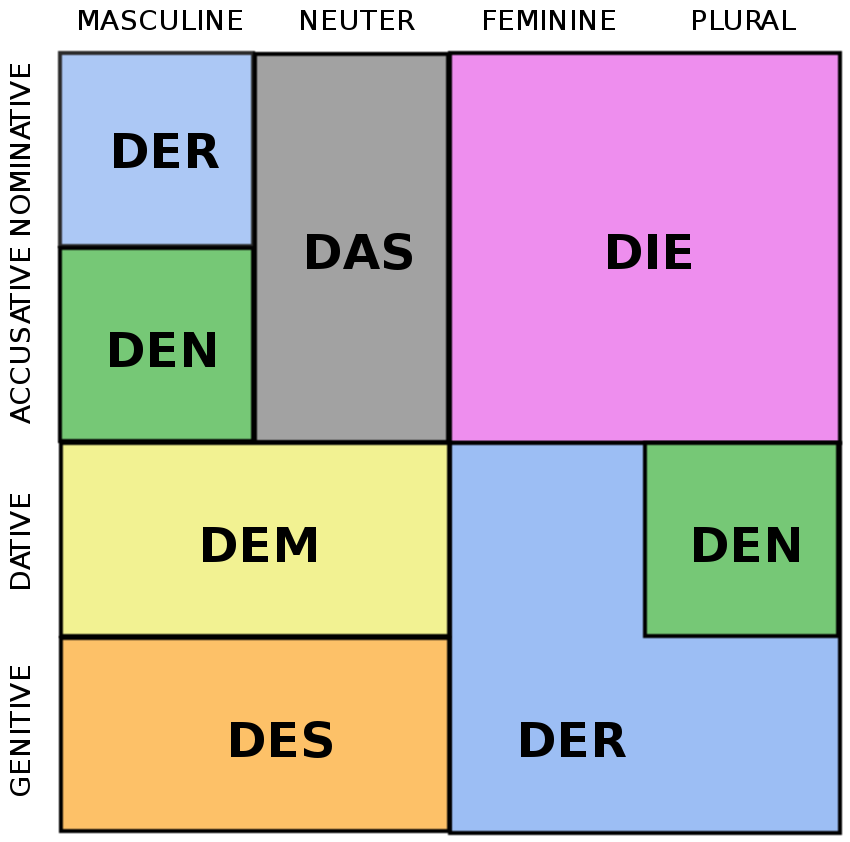

### Personalpronomen 
|Nom  |Akku |Dativ |Genitiv|
|---|---|---|---|
|ich|   |   |   |
|du |   |   |   |
|sie|   |   |   |
|es |   |   |   |
|er |   |   |   |
|wir|   |   |   |
|ihr|   |   |   |
|sie/Sie|   |   |   |

### Possessivartikel
|  |feminin  |neutrum |maskulin |plural|
|---|---|---|---|---|
|ich|   |   |   |   |  
|du |   |   |   |   |
|sie|   |   |   |   |   
|es |   |   |   |   |
|er |   |   |   |   |
|wir|   |   |   |   |
|ihr|   |   |   |   |
|sie/Sie|   |   |   |

### Artikel
|   |der |die |das |die |
|---|---|---|---|---|
|Nom   |der   |die   |das   |die   |
|Gen   |des   |der   |des   |der   |
|Dativ   |dem   |der   |dem   |den   |
|Akku   |den   |die   |das   |den   |

